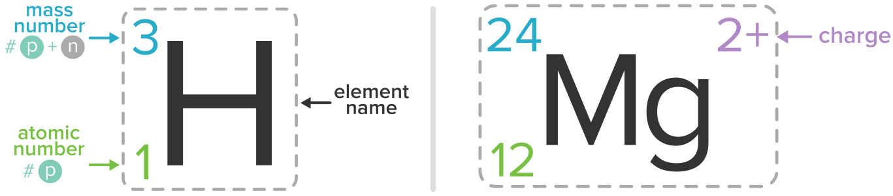
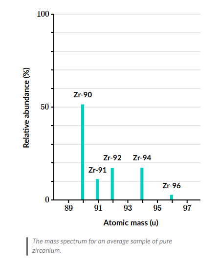
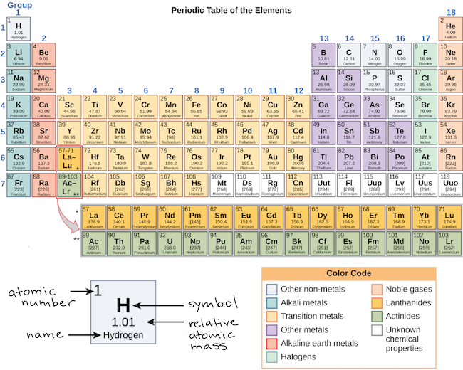
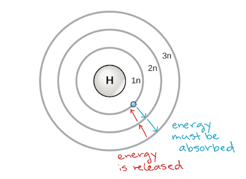
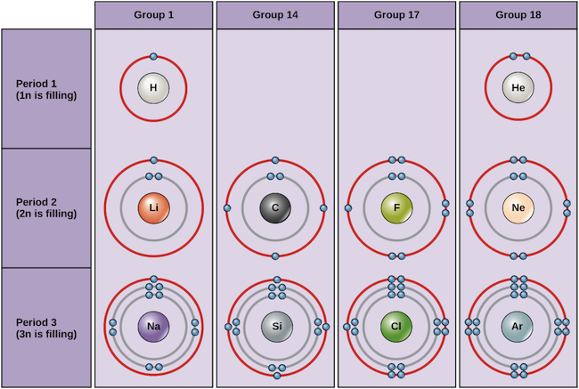
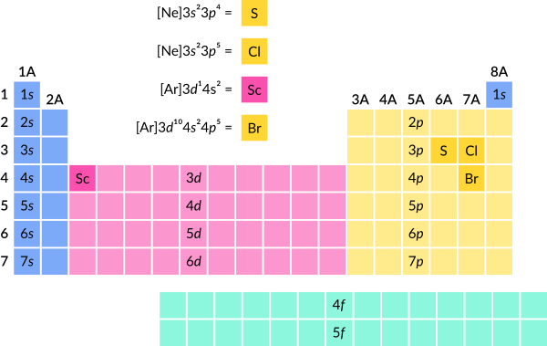

# Atomic Structure and Properties

```{contents}
:local:
```

## Isotopes

### **Defining Elements and Atomic Number**
- **Element Identification**: Determined by the number of **protons** in an atom's nucleus.
  - **Hydrogen**: 1 proton
  - **Carbon**: 6 protons
  - **Chlorine**: 17 protons
- **Atomic Number**: Number of protons in an atom, defining the element.

---

### **Isotopes**
- **Definition**: Different versions of the same element, with the same number of protons but a different number of neutrons.
- **Example**: Chlorine has two stable isotopes:
  - **Chlorine-35**
    - Mass Number: 35 (Protons + Neutrons)
    - Protons: 17 (since it’s chlorine)
    - Neutrons: $ 35 - 17 = 18 $
  - **Chlorine-37**
    - Mass Number: 37
    - Protons: 17
    - Neutrons: $ 37 - 17 = 20 $

---

### Atomic Mass
- **Periodic Table**: Displays an **average atomic mass**, not individual isotope masses.
- **Average Atomic Mass Calculation**:
  - Formula:  
    $
    \text{Average Mass} = (\% \text{ of Isotope 1}) \times (\text{Mass of Isotope 1}) + (\% \text{ of Isotope 2}) \times (\text{Mass of Isotope 2})
    $
  - $ \text{Average Atomic Mass} = \sum_{i=1}^{n} \text{(relative abundance} \times \text{atopic mass)}_i$
  - Chlorine Example:
    - **Chlorine-35**: 75.77% in nature
    - **Chlorine-37**: 24.23% in nature
    - Result: $ 35.45 \, \text{u (unified atomic mass units)} $
### Example Isotopic notation


### Sample Mass Specturm

---

### **Understanding Atomic Mass Units**
- **Approximation**:
  - Proton Mass ≈ 1 unified atomic mass unit (u)
  - Neutron Mass ≈ 1 u
  - Electron Mass: Negligible for atomic mass purposes.
- **Mass Defect**:
  - Actual atomic mass is slightly less than the sum of individual nucleon masses due to nuclear binding energy.

---

### **Additional Insights**
- **Atomic Mass of Chlorine-35**:
  - Slightly under 35 u.
  - Caused by variations in individual nucleon mass and the mass defect.
  - Can be referenced in detailed tables.

## Half-Life in Chemistry

The **half-life** of a substance is the amount of time it takes for half of a sample of a radioactive isotope, or any substance undergoing a decay or transformation process, to decay or be transformed into a different substance.

---

### **Key Points about Half-Life**:
1. **Definition**:
   - It is the time required for **50% of the original amount** of a radioactive isotope to decay.
   - For substances, it can also apply to chemical reactions, where it indicates the time for half the reactant to be consumed.

2. **Applications**:
   - **Radioactive Decay**: Used to determine the stability and lifespan of isotopes (e.g., carbon-14 in radiocarbon dating).
   - **Kinetics**: In chemical reactions, half-life is used to study reaction rates, particularly for first-order reactions.

3. **Mathematical Expression**:
   - For **radioactive decay** (a first-order process):
     $N(t) = N_0 \cdot e^{-\lambda t}$
     - $N(t)$: Amount of substance remaining at time $t$.
     - $N_0$: Initial amount of substance.
     - $\lambda$: Decay constant.
   - The half-life ($t_{1/2}$) is related to $\lambda$:
     $t_{1/2} = \frac{\ln(2)}{\lambda}$
   - For other orders of reactions, the formula for half-life differs.

4. **Examples**:
   - **Radioactive Substances**:
     - Carbon-14: Half-life ~ 5730 years (used in dating ancient artifacts).
     - Uranium-238: Half-life ~ 4.5 billion years (used in geological dating).
   - **Chemical Reactions**:
     - Reaction rates in drugs and metabolism often use half-life to measure how quickly a drug concentration reduces in the body.

---

### **Significance**:
- **Predicting Decay**: Knowing the half-life helps in determining how long a material will remain active.
- **Practical Use**: Used in medicine, archaeology, nuclear physics, and environmental science to calculate dosages, date objects, or understand environmental impacts.

## Empirical, molecular, and structural formulas

### **Ways to Represent a Molecule**

1. **Name**:
   - Simplest way to refer to a molecule (e.g., *benzene*).
   - Provides little information about the molecular composition.

---

2. **Empirical Formula**:
   - **Definition**: Represents the ratio of elements in a molecule.
   - **Origin**: Derived from experimental observations of element ratios in early chemistry.
   - **Example**:
     - Benzene: $ \text{C}_1\text{H}_1 $ (1 carbon: 1 hydrogen).
     - Water: $ \text{H}_2\text{O} $ (2 hydrogens: 1 oxygen).
   - **Purpose**: Useful for understanding elemental composition ratios but not actual quantities.

---

3. **Molecular Formula**:
   - **Definition**: Indicates the exact number of each type of atom in a molecule.
   - **Example**:
     - Benzene: $ \text{C}_6\text{H}_6 $ (6 carbons, 6 hydrogens).
     - Water: $ \text{H}_2\text{O} $ (2 hydrogens, 1 oxygen).
   - **Relation to Empirical Formula**:
     - The molecular formula can simplify to the empirical formula by reducing the ratio (e.g., $ \text{C}_6\text{H}_6 \to \text{C}_1\text{H}_1 $).

---

4. **Structural Formula**:
   - **Definition**: Shows the arrangement and bonding of atoms in the molecule.
   - **Details**:
     - Bonds: Represents covalent bonds (electron sharing).
     - Includes 2D or 3D representations.
   - **Examples**:
     - **Benzene**: Drawn as a hexagon with alternating double bonds, each carbon bonded to one hydrogen.
     - **Water**: Oxygen bonded to two hydrogens.
   - **Organic Chemistry Convention**:
     - Atoms like carbon are often implicit at vertices of structures.
     - Hydrogen is implied to complete the required bonds if not explicitly shown.

---

### **Key Insights**
- **Hierarchy of Information**:
  - Empirical Formula → Molecular Formula → Structural Formula.
  - Each provides progressively more detail about the molecule.
- **Empirical ≠ Molecular Formula**:
  - They are identical when the ratios match the actual atomic quantities (e.g., water).
  - They differ when the molecular formula reflects multiples of the ratio (e.g., benzene).

---

### **Applications**
- Different representations are used depending on the level of detail needed for chemical analysis, synthesis, or study.

---

### **Calculating Percentage of Carbon by Mass in Glucose**

1. **Molecular Formula of Glucose**:
   - $ \text{C}_6\text{H}_{12}\text{O}_6 $:
     - 6 Carbon (C), 12 Hydrogen (H), 6 Oxygen (O).

2. **Goal**:
   - Determine the **percentage of carbon by mass** in glucose.

---

### **Step-by-Step Calculation**

#### **Step 1: Define the Mass of Carbon in Glucose**
- For every **1 mole of glucose**, there are:
  - **6 moles of Carbon**.
- **Mass of Carbon**:
  - Molar mass of carbon = $ 12.01 \, \text{g/mol} $.
  - Total mass = $ 6 \times 12.01 = 72.06 \, \text{g} $.

#### **Step 2: Define the Total Mass of Glucose**
- Glucose contains:
  - 6 moles of Carbon.
  - 12 moles of Hydrogen ($ 1.008 \, \text{g/mol} $).
  - 6 moles of Oxygen ($ 16.00 \, \text{g/mol} $).
- **Mass Contributions**:
  - Carbon: $ 6 \times 12.01 = 72.06 \, \text{g} $.
  - Hydrogen: $ 12 \times 1.008 = 12.096 \, \text{g} $.
  - Oxygen: $ 6 \times 16.00 = 96.00 \, \text{g} $.
- **Total Mass of Glucose**:
  $$
  72.06 + 12.096 + 96.00 = 180.156 \, \text{g}.
  $$

#### **Step 3: Calculate the Percentage of Carbon by Mass**
- Formula:
  $$
  \text{Percentage of Carbon by Mass} = \frac{\text{Mass of Carbon}}{\text{Total Mass of Glucose}} \times 100
  $$
- Substitution:
  $$
  \frac{72.06}{180.156} \times 100 = 40.00\%.
  $$

---

### **Key Insights**
1. **Significant Figures**:
   - The final result is rounded to **4 significant figures** due to the limiting precision in the given atomic masses.
   - Final answer: **40.00% carbon by mass**.
2. **Independent of Sample Size**:
   - The percentage of carbon remains the same regardless of the amount of glucose in the sample.

--- 

This method can be applied to calculate the percentage composition of any element in a compound.

### **Determining the Empirical Formula of a Molecule**

1. **Given Data**:
   - Composition by mass:
     - **Mercury (Hg)**: 73%
     - **Chlorine (Cl)**: 27%
   - Assumed total mass of the sample: **100 grams** (for simplicity).

---

### **Step-by-Step Process**

#### **Step 1: Calculate Moles of Each Element**

1. **Mercury (Hg)**:
   - Mass: $ 73 \, \text{g} $
   - Molar mass: $ 200.59 \, \text{g/mol} $
   - Moles of mercury:
     $$
     \text{Moles of Hg} = \frac{73}{200.59} \approx 0.36 \, \text{moles}.
     $$

2. **Chlorine (Cl)**:
   - Mass: $ 27 \, \text{g} $
   - Molar mass: $ 35.45 \, \text{g/mol} $
   - Moles of chlorine:
     $$
     \text{Moles of Cl} = \frac{27}{35.45} \approx 0.76 \, \text{moles}.
     $$

---

#### **Step 2: Determine the Simplest Mole Ratio**

1. **Ratio Calculation**:
   - Moles of mercury to moles of chlorine:
     $$
     \frac{\text{Moles of Hg}}{\text{Moles of Hg}} = 1, \quad \frac{\text{Moles of Cl}}{\text{Moles of Hg}} \approx \frac{0.76}{0.36} \approx 2.
     $$
   - For every **1 mercury atom**, there are approximately **2 chlorine atoms**.

2. **Simplest Ratio**:
   - The simplest integer ratio is $ \text{Hg:Cl} = 1:2 $.

---

#### **Step 3: Empirical Formula**
- Based on the mole ratio, the **empirical formula** is:
  $$
  \text{HgCl}_2
  $$

---

### **Key Points**

1. **Name of the Molecule**:
   - The molecule is named **mercury(II) chloride**.
     - The "(II)" indicates the oxidation state of mercury.

2. **Assumptions and Simplifications**:
   - Assumed total sample mass of $ 100 \, \text{g} $ simplifies calculations.
   - Empirical formulas provide the simplest whole-number ratio of atoms in a compound.

---

This method of determining the empirical formula is a standard approach in chemical analysis when given the percentage composition of a compound.

### **Determining the Empirical Formula of a Compound**

1. **Problem Statement**:
   - A compound containing **carbon (C)** and **hydrogen (H)** is completely combusted, producing:
     - **5.65 grams of CO₂**.
     - **3.47 grams of H₂O**.
   - Determine the **empirical formula** of the compound.

---

### **Step-by-Step Solution**

#### **Step 1: Calculate the Moles of Carbon**
- All carbon in the compound ends up in **CO₂**.
- Given:
  - Mass of CO₂ = $ 5.65 \, \text{g} $
  - Molar mass of CO₂ = $ 12.01 + 2(16.00) = 44.01 \, \text{g/mol} $
- Moles of CO₂:
  $$
  \text{Moles of CO₂} = \frac{5.65}{44.01} \approx 0.128 \, \text{mol}.
  $$
- Since each molecule of CO₂ contains 1 atom of carbon:
  $$
  \text{Moles of Carbon} = 0.128 \, \text{mol}.
  $$

---

#### **Step 2: Calculate the Moles of Hydrogen**
- All hydrogen in the compound ends up in **H₂O**.
- Given:
  - Mass of H₂O = $ 3.47 \, \text{g} $
  - Molar mass of H₂O = $ 2(1.008) + 16.00 = 18.016 \, \text{g/mol} $
- Moles of H₂O:
  $$
  \text{Moles of H₂O} = \frac{3.47}{18.016} \approx 0.193 \, \text{mol}.
  $$
- Each molecule of H₂O contains 2 atoms of hydrogen:
  $$
  \text{Moles of Hydrogen} = 0.193 \times 2 \approx 0.385 \, \text{mol}.
  $$

---

#### **Step 3: Determine the Simplest Mole Ratio**
- Ratio of **hydrogen to carbon**:
  $$
  \text{Ratio} = \frac{\text{Moles of Hydrogen}}{\text{Moles of Carbon}} = \frac{0.385}{0.128} \approx 3.
  $$
- For every **1 mole of carbon**, there are **3 moles of hydrogen**.

---

#### **Step 4: Empirical Formula**
- The empirical formula is:
  $$
  \text{CH}_3
  $$

---

### **Key Insights**
1. **Empirical Formula**:
   - Describes the simplest whole-number ratio of elements in the compound.
   - For this compound, the ratio is **1 carbon : 3 hydrogen**.
2. **Combustion Analysis**:
   - CO₂ provides information about carbon content.
   - H₂O provides information about hydrogen content.

This process is widely used in organic chemistry to deduce molecular structures.

---

### **Calculating the Mass of Potassium Chloride in a Supplement**

#### **Given Data**:
1. **Mass of Potassium Supplement**: $ 0.450 \, \text{g} $
2. **Potassium Content by Mass**: $ 22\% $
3. **Molar Mass of Potassium Chloride ($ \text{KCl} $)**: $ 74.55 \, \text{g/mol} $
4. **Molar Mass of Potassium ($ \text{K} $)**: $ 39.10 \, \text{g/mol} $

---

### **Step-by-Step Calculation**

#### **Step 1: Calculate the Mass of Potassium in the Supplement**
$$
\text{Mass of Potassium} = \text{Mass of Supplement} \times \text{Potassium Percentage}
$$
$$
\text{Mass of Potassium} = 0.450 \times 0.22 = 0.099 \, \text{g}.
$$

---

#### **Step 2: Convert the Mass of Potassium to Moles**
$$
\text{Moles of Potassium} = \frac{\text{Mass of Potassium}}{\text{Molar Mass of Potassium}}
$$
$$
\text{Moles of Potassium} = \frac{0.099}{39.10} \approx 0.00253 \, \text{mol}.
$$

---

#### **Step 3: Determine the Moles of Potassium Chloride**
- **1 Mole of Potassium (K)** corresponds to **1 Mole of Potassium Chloride (KCl)**:
$$
\text{Moles of Potassium Chloride} = \text{Moles of Potassium} = 0.00253 \, \text{mol}.
$$

---

#### **Step 4: Calculate the Mass of Potassium Chloride**
$$
\text{Mass of Potassium Chloride} = \text{Moles of Potassium Chloride} \times \text{Molar Mass of Potassium Chloride}
$$
$$
\text{Mass of Potassium Chloride} = 0.00253 \times 74.55 \approx 0.1886 \, \text{g}.
$$

---

#### **Step 5: Round to Significant Figures**
- The limiting factor is **3 significant figures**:
$$
\text{Mass of Potassium Chloride} = 0.189 \, \text{g}.
$$

---

### **Final Answer**:
The mass of potassium chloride in the supplement is:
$$
\boxed{0.189 \, \text{g}}
$$

### **Determining the Composition of the Sample**

#### **Problem Statement**:
1. The sample is suspected to contain **sodium chloride (NaCl)** and possibly **sodium iodide (NaI)**, **potassium chloride (KCl)**, or **lithium chloride (LiCl)**.
2. The sample has **73% chlorine by mass**.
3. Determine:
   - If the sample is pure sodium chloride.
   - If not, what other compound(s) it likely contains.

---

### **Step-by-Step Solution**

#### **Step 1: Calculate the Chlorine Percentage by Mass for Each Compound**
1. **Sodium Chloride ($ \text{NaCl} $)**:
   - Molar mass of $ \text{NaCl} = 22.99 + 35.45 = 58.44 \, \text{g/mol} $.
   - Percentage of chlorine:
     $$
     \text{Percent Cl} = \frac{35.45}{58.44} \times 100 \approx 61\%.
     $$

2. **Sodium Iodide ($ \text{NaI} $)**:
   - $ \text{NaI} $ contains **no chlorine**.
   - Percentage of chlorine:
     $$
     \text{Percent Cl} = 0\%.
     $$

3. **Potassium Chloride ($ \text{KCl} $)**:
   - Molar mass of $ \text{KCl} = 39.10 + 35.45 = 74.55 \, \text{g/mol} $.
   - Percentage of chlorine:
     $$
     \text{Percent Cl} = \frac{35.45}{74.55} \times 100 \approx 47.6\%.
     $$

4. **Lithium Chloride ($ \text{LiCl} $)**:
   - Molar mass of $ \text{LiCl} = 6.94 + 35.45 = 42.39 \, \text{g/mol} $.
   - Percentage of chlorine:
     $$
     \text{Percent Cl} = \frac{35.45}{42.39} \times 100 \approx 83.6\%.
     $$

---

#### **Step 2: Analyze the Sample**
1. **Is the sample pure sodium chloride?**
   - Pure sodium chloride has **61% chlorine by mass**, which is less than the observed **73%**.
   - **Conclusion**: The sample is **not pure sodium chloride**.

2. **What else could be in the sample?**
   - Sodium iodide contains no chlorine, so its addition would **reduce** the chlorine percentage (not plausible).
   - Potassium chloride has a lower percentage of chlorine than sodium chloride, so its addition would also **reduce** the chlorine percentage (not plausible).
   - Lithium chloride has **83.6% chlorine by mass**, which is **greater than 61%**, so its addition could **increase** the chlorine percentage to **73%**.
   - **Conclusion**: The sample likely contains a mixture of **sodium chloride** and **lithium chloride**.

---

#### **Step 3: Determine the Composition of the Mixture**
1. Let $ x $ be the mass fraction of sodium chloride, and $ 1 - x $ be the mass fraction of lithium chloride.
2. The chlorine percentage by mass of the mixture is given by:
   $$
   61x + 83.6(1 - x) = 73.
   $$
3. Simplify the equation:
   $$
   61x + 83.6 - 83.6x = 73,
   $$
   $$
   -22.6x + 83.6 = 73,
   $$
   $$
   -22.6x = -10.6,
   $$
   $$
   x \approx 0.469.
   $$

4. Composition:
   - Sodium chloride: $ 46.9\% $.
   - Lithium chloride: $ 53.1\% $.

---

### **Final Answer**:
- The sample is a mixture of **sodium chloride (46.9%)** and **lithium chloride (53.1%)**.

## The periodic table, electron shells, and orbitals



### Electron shells and the Bohr model
An early model of the atom was developed in 1913 by the Danish scientist Niels Bohr (1885–1962). The Bohr model shows the atom as a central nucleus containing protons and neutrons, with the electrons in circular electron shells at specific distances from the nucleus, similar to planets orbiting around the sun. Each electron shell has a different energy level, with those shells closest to the nucleus being lower in energy than those farther from the nucleus. By convention, each shell is assigned a number and the symbol n—for example, the electron shell closest to the nucleus is called 1n. In order to move between shells, an electron must absorb or release an amount of energy corresponding exactly to the difference in energy between the shells. For instance, if an electron absorbs energy from a photon, it may become excited and move to a higher-energy shell; conversely, when an excited electron drops back down to a lower-energy shell, it will release energy, often in the form of heat.



### Electron configurations and the periodic table

Examples of some neutral atoms and their electron configurations are shown below. In this table, you can see that helium has a full valence shell, with two electrons in its first and only, 1n, shell. Similarly, neon has a complete outer 2n shell containing eight electrons. These electron configurations make helium and neon very stable. Although argon does not technically have a full outer shell, since the 3n shell can hold up to eighteen electrons, it is stable like neon and helium because it has eight electrons in the 3n shell and thus satisfies the octet rule. In contrast, chlorine has only seven electrons in its outermost shell, while sodium has just one. These patterns do not fill the outermost shell or satisfy the octet rule, making chlorine and sodium reactive, eager to gain or lose electrons to reach a more stable configuration.



### Octet Rule

The octet rule is a fundamental concept in chemistry that describes how atoms bond to achieve a stable electron configuration. It states that atoms tend to form compounds in ways that give them eight electrons in their valence shell, thereby attaining the electron configuration of a noble gas. 

**Explanation:**

- **Valence Electrons:** These are the electrons in the outermost shell of an atom and are crucial in chemical bonding.

- **Stability Through Octet:** Atoms with incomplete valence shells are generally unstable. By gaining, losing, or sharing electrons to complete an octet (eight electrons) in their valence shell, they achieve greater stability.

**Examples:**

1. **Sodium Chloride (NaCl):**

   - *Sodium (Na):* Has one valence electron. It can achieve an octet by losing this electron, resulting in a positively charged ion (Na⁺).

   - *Chlorine (Cl):* Has seven valence electrons. It can achieve an octet by gaining one electron, forming a negatively charged ion (Cl⁻).

   - The electrostatic attraction between Na⁺ and Cl⁻ leads to the formation of an ionic bond, resulting in NaCl. 

2. **Carbon Dioxide (CO₂):**

   - *Carbon (C):* Has four valence electrons. It can achieve an octet by sharing four electrons through double bonds.

   - *Oxygen (O):* Each oxygen atom has six valence electrons. By sharing two electrons with carbon, each oxygen achieves an octet.

   - This sharing results in two double bonds, creating a linear CO₂ molecule. 

**Exceptions to the Octet Rule:**

While the octet rule applies to many elements, especially among the main-group elements, there are notable exceptions:

- **Incomplete Octet:** Elements like hydrogen (stable with two electrons), boron, and beryllium often have fewer than eight electrons in their compounds. 

- **Expanded Octet:** Elements in the third period and beyond, such as phosphorus and sulfur, can have more than eight electrons in their valence shells due to available d-orbitals. For example, phosphorus pentachloride (PCl₅) and sulfur hexafluoride (SF₆) exhibit expanded octets. 

- **Free Radicals:** Molecules with an odd number of electrons, like nitric oxide (NO), cannot distribute electrons to give eight to each atom. 

**Limitations:**

The octet rule is a useful guideline but doesn't apply universally. Transition metals, for instance, often do not follow the octet rule due to their d-electrons. Additionally, the rule doesn't account for molecular shapes, bond strengths, or the presence of molecules with electron deficiencies or excesses. 

Understanding the octet rule provides a foundational framework for predicting and rationalizing the bonding behavior of many elements, though it's essential to recognize its exceptions and limitations.

---

### The Aufbau Principle

#### **1. Introduction to Orbitals and Electron Configuration**
- **Orbitals**: Regions around an atom's nucleus where electrons are likely to be found.
- **Subshells**: Groupings of orbitals ($ s, p, d, f $) within a shell.
- **Electron Configuration**: Describes the distribution of electrons among orbitals in an atom.

---

#### **2. Aufbau Principle**
- **Definition**: A guideline for filling electron orbitals in an atom, based on increasing energy levels.
  - Aufbau (German) = "Building up."
- **Order of Orbital Filling**:
  - $ 1s \to 2s \to 2p \to 3s \to 3p \to 4s \to 3d \to 4p \to 5s $, and so on.

---

#### **3. Examples of Electron Configuration**
1. **Neon ($ \text{Ne} $)**:
   - Atomic number: 10
   - Configuration: $ 1s^2 \, 2s^2 \, 2p^6 $.

2. **Argon ($ \text{Ar} $)**:
   - Atomic number: 18
   - Configuration (using noble gas notation): $ [\text{Ne}] \, 3s^2 \, 3p^6 $.

3. **Calcium ($ \text{Ca} $)**:
   - Atomic number: 20
   - Configuration: $ [\text{Ar}] \, 4s^2 $ (electrons fill the $ 4s $ orbital instead of $ 3d $).

4. **Scandium ($ \text{Sc} $)**:
   - Atomic number: 21
   - Configuration: $ [\text{Ar}] \, 4s^2 \, 3d^1 $.

---

#### **4. Orbital Filling Observations**
- **Surprise in Filling**:
  - Electrons fill the $ 4s $ orbital before $ 3d $, even though $ 4s $ is higher in energy in isolated atoms.
- **Beyond Calcium**:
  - Filling orders and precise orbital energies can vary based on interactions within the atom.

---

#### **5. Periodic Table Patterns**
1. **Blocks in the Periodic Table**:
   - **S Block**: Elements in the first two groups (and helium) are filling their $ s $-subshells.
   - **P Block**: Elements in groups 13–18 are filling their $ p $-subshells.
   - **D Block**: Transition metals (groups 3–12) are filling their $ d $-subshells.

2. **Why Blocks Are Named**:
   - $ s, p, d, f $ blocks correspond to the type of subshell being filled, based on the Aufbau principle.

---

#### **6. Limitations of the Aufbau Principle**
- While helpful for understanding basic electron configurations:
  - Real electron filling order may differ, particularly beyond calcium.
  - Electrons in certain atoms may prefer lower energy $ d $-orbitals before filling $ 4s $.

---

#### **Key Takeaways**
1. The Aufbau principle provides a simplified way to determine electron configurations.
2. Periodic table blocks reflect subshell filling:
   - $ s $-block, $ p $-block, $ d $-block.
3. Real-world electron filling can deviate from the Aufbau principle in complex atoms.
4. Orbital filling patterns offer insights into chemical properties and periodic trends.

#### **Additonal Notes Historical Origin of Orbital Names**
1. **Spectroscopic Basis**:
   - The names $ s, p, d, f $ come from **spectroscopic terms** used to describe lines in atomic emission spectra before quantum mechanics was fully developed.
   - Observed lines were initially categorized as:
     - **Sharp (s)**,
     - **Principal (p)**,
     - **Diffuse (d)**, and
     - **Fundamental (f)**.
   - These names were based on the appearance of spectral lines and were carried over to describe orbitals.

2. **Subsequent Orbitals**:
   - After $ f $, the naming continued alphabetically:
     - **g, h, i, ...** are used for theoretical or highly excited states, though they rarely appear in most practical chemistry contexts.

---

### **Why No Pattern?**
The lack of a pattern in the first four letters reflects the historical, observational nature of their origins. As quantum mechanics developed, these labels became shorthand for specific subshells:
- **s**: Angular momentum quantum number $ l = 0 $ (spherical orbital).
- **p**: $ l = 1 $ (dumbbell-shaped orbitals).
- **d**: $ l = 2 $ (four-leaf clover-shaped orbitals).
- **f**: $ l = 3 $ (complex shapes).

The designations are now an integral part of how we describe electron configurations, even though their origins are somewhat arbitrary.

---

## Valence electrons

### **Key Concepts**

#### **1. Electron Configuration and Its Purpose**
- **Purpose**: Electron configurations help predict how an atom will react with others by revealing:
  - Which electrons are involved in chemical reactions (**valence electrons**).
  - Which electrons are not involved (**core electrons**).

---

#### **2. Valence and Core Electrons**
- **Valence Electrons**:
  - Electrons in the outermost shell.
  - Participate in chemical bonding and reactions.
- **Core Electrons**:
  - Electrons in inner shells.
  - Do not typically participate in reactions.

---

#### **3. Examples**

##### **Oxygen**
- **Electron Configuration**: $ 1s^2 \, 2s^2 \, 2p^4 $
- **Valence Electrons**:
  - Outer shell (2nd shell): $ 2s^2 \, 2p^4 $ → **6 valence electrons**.
- **Core Electrons**:
  - Inner shell (1st shell): $ 1s^2 $ → **2 core electrons**.
- **Reactivity**:
  - Oxygen tends to gain 2 electrons to fill its outer shell (achieve $ 2s^2 \, 2p^6 $).
  - Forms ions or bonds to stabilize (e.g., $ \text{O}^{2-} $).

##### **Calcium**
- **Electron Configuration**: $ [\text{Ar}] \, 4s^2 $
- **Valence Electrons**:
  - Outer shell (4th shell): $ 4s^2 $ → **2 valence electrons**.
- **Core Electrons**:
  - Inner shells (1st, 2nd, and 3rd): $ [\text{Ar}] $ → **18 core electrons**.
- **Reactivity**:
  - Calcium tends to lose its 2 valence electrons, becoming $ \text{Ca}^{2+} $, to achieve a stable configuration like argon ($ [\text{Ar}] $).

---

#### **4. Stability and the Octet Rule**
- Atoms are more stable when:
  - Their outermost shell is **full**.
  - Typically, $ s $ and $ p $ subshells are filled (8 electrons in total).
- Examples:
  - Oxygen gains 2 electrons to complete 8 in the 2nd shell.
  - Calcium loses 2 electrons to expose the filled 3rd shell.

---

### **Periodic Table Patterns**
1. **Valence Electrons by Column (Group)**:
   - **S-block**: Groups 1 (1 valence electron) and 2 (2 valence electrons).
   - **P-block**: Groups 13–18:
     - Group 13: 3 valence electrons.
     - Group 14: 4 valence electrons.
     - Group 15: 5 valence electrons.
     - Group 16: 6 valence electrons.
     - Group 17: 7 valence electrons.
     - Group 18: 8 valence electrons (noble gases, stable).

2. **Reactivity**:
   - Elements with nearly full or nearly empty valence shells are highly reactive.
   - Noble gases (Group 18) are unreactive due to full outer shells.

---

### **Key Takeaways**
- **Valence Electrons**: Determine chemical reactivity.
- **Core Electrons**: Remain stable and unaffected during reactions.
- The **octet rule** guides most reactivity, where atoms aim for a full outer shell.
- Periodic table group numbers help predict the number of valence electrons.

---

## Electron configurations of ions

### **Key Concepts**

1. **Ions**:
   - **Cations**: Positively charged ions (formed by losing electrons).
   - **Anions**: Negatively charged ions (formed by gaining electrons).

2. **Electron Configuration of Ions**:
   - Start with the **electron configuration of the neutral atom**.
   - Adjust the number of electrons based on the charge:
     - Remove electrons (from the outermost shell first) for cations.
     - Add electrons to the appropriate subshell for anions.

---

### **Examples**

#### **1. Fluorine ($ \text{F} $)**
- **Neutral Atom**:
  - Atomic number: 9 (9 electrons).
  - Electron configuration: $ 1s^2 \, 2s^2 \, 2p^5 $.
- **Fluoride Ion ($ \text{F}^- $)**:
  - Gains 1 electron → $ 2p^5 \to 2p^6 $.
  - Electron configuration: $ 1s^2 \, 2s^2 \, 2p^6 $ (same as neon).

#### **2. Calcium ($ \text{Ca} $)**
- **Neutral Atom**:
  - Atomic number: 20 (20 electrons).
  - Electron configuration (noble gas notation): $ [\text{Ar}] \, 4s^2 $.
- **Calcium Ion ($ \text{Ca}^{2+} $)**:
  - Loses 2 electrons from the $ 4s $ subshell.
  - Electron configuration: $ [\text{Ar}] $ (same as argon).

---

### **Key Observations**
1. **Anions**:
   - Gain electrons to fill their outermost subshell.
   - Often reach the configuration of the nearest noble gas.
   - Example: $ \text{F}^- $ becomes $ [\text{Ne}] $.

2. **Cations**:
   - Lose electrons from the outermost shell.
   - If the outer shell is completely emptied, the configuration matches a noble gas.
   - Example: $ \text{Ca}^{2+} $ becomes $ [\text{Ar}] $.

3. **Energy Considerations**:
   - Electrons are removed from the highest energy orbitals first (e.g., $ 4s $ before $ 3d $).

---

### **Tips for Practice**
1. Use the **noble gas notation** to simplify configurations.
2. Focus on the **outermost shell/subshell** for gaining or losing electrons.
3. Practice with different elements to understand periodic trends in ion formation:
   - Metals tend to form cations.
   - Nonmetals tend to form anions. 

These examples highlight how electron configurations change when atoms become ions, helping to explain their chemical behavior.

Here are the electron configurations for all noble gases:

---

### **Noble Gases and Their Electron Configurations**

1. **Helium ($ \text{He} $)**:
   - Atomic number: 2
   - Configuration: $ 1s^2 $

2. **Neon ($ \text{Ne} $)**:
   - Atomic number: 10
   - Configuration: $ 1s^2 \, 2s^2 \, 2p^6 $

3. **Argon ($ \text{Ar} $)**:
   - Atomic number: 18
   - Configuration: $ 1s^2 \, 2s^2 \, 2p^6 \, 3s^2 \, 3p^6 $

4. **Krypton ($ \text{Kr} $)**:
   - Atomic number: 36
   - Configuration: $ 1s^2 \, 2s^2 \, 2p^6 \, 3s^2 \, 3p^6 \, 4s^2 \, 3d^{10} \, 4p^6 $

5. **Xenon ($ \text{Xe} $)**:
   - Atomic number: 54
   - Configuration: $ 1s^2 \, 2s^2 \, 2p^6 \, 3s^2 \, 3p^6 \, 4s^2 \, 3d^{10} \, 4p^6 \, 5s^2 \, 4d^{10} \, 5p^6 $

6. **Radon ($ \text{Rn} $)**:
   - Atomic number: 86
   - Configuration: $ 1s^2 \, 2s^2 \, 2p^6 \, 3s^2 \, 3p^6 \, 4s^2 \, 3d^{10} \, 4p^6 \, 5s^2 \, 4d^{10} \, 5p^6 \, 6s^2 \, 4f^{14} \, 5d^{10} \, 6p^6 $

7. **Oganesson ($ \text{Og} $)** (predicted):
   - Atomic number: 118
   - Configuration (predicted): $ 1s^2 \, 2s^2 \, 2p^6 \, 3s^2 \, 3p^6 \, 4s^2 \, 3d^{10} \, 4p^6 \, 5s^2 \, 4d^{10} \, 5p^6 \, 6s^2 \, 4f^{14} \, 5d^{10} \, 6p^6 \, 7s^2 \, 5f^{14} \, 6d^{10} \, 7p^6 $

---

### **Key Characteristics**
- Noble gases have **completely filled outer shells**, making them highly stable and unreactive.
- Their configurations end in $ s^2 \, p^6 $ (except helium, which ends in $ s^2 $).

These electron configurations explain the chemical inertness of noble gases.

## Periodic trends and Coulomb's law

**Notes on Periodic Trends**

---

### **Key Periodic Trends**

1. **Atomic Radius**:
   - **Trend Across a Period (Left to Right)**:
     - Radius **decreases** because the **effective nuclear charge ($ Z_{\text{eff}} $)** increases.
     - Higher $ Z_{\text{eff}} $ pulls the valence electrons closer to the nucleus.
   - **Trend Down a Group (Top to Bottom)**:
     - Radius **increases** due to the addition of electron shells, increasing the distance between the nucleus and valence electrons.

2. **Ionization Energy**:
   - **Definition**: The energy required to remove the outermost electron.
   - **Trend Across a Period (Left to Right)**:
     - Ionization energy **increases** due to a higher $ Z_{\text{eff}} $, making it harder to remove an electron.
   - **Trend Down a Group (Top to Bottom)**:
     - Ionization energy **decreases** because outer electrons are farther from the nucleus and experience more shielding.

3. **Electron Affinity**:
   - **Definition**: The energy released when an electron is added to a neutral atom.
   - **Trend Across a Period (Left to Right)**:
     - Electron affinity generally **increases** (more negative values, more energy released) as $ Z_{\text{eff}} $ increases.
     - Halogens (Group 17) have the highest electron affinities.
   - **Trend Down a Group (Top to Bottom)**:
     - Electron affinity **decreases** because the added electron is farther from the nucleus and experiences less attraction.
   - **Noble Gases**: Have very low or no electron affinity since their outer shells are full.

4. **Electronegativity**:
   - **Definition**: An atom's tendency to attract a shared pair of electrons in a bond.
   - **Trend Across a Period (Left to Right)**:
     - Electronegativity **increases** as $ Z_{\text{eff}} $ increases.
   - **Trend Down a Group (Top to Bottom)**:
     - Electronegativity **decreases** due to increased atomic radius and shielding.
   - **Most Electronegative Element**: Fluorine.

---

### **Coulomb's Law in Periodic Trends**
$$
F \propto \frac{q_1 \cdot q_2}{r^2}
$$
- **$ q_1 $**: Effective nuclear charge ($ Z_{\text{eff}} $).
- **$ q_2 $**: Charge of the valence electron.
- **$ r $**: Distance between nucleus and valence electrons.
- Higher $ Z_{\text{eff}} $ and lower $ r $ lead to stronger attractive forces, influencing all periodic trends.

---

### **Summary of Trends**
| Property                | Across a Period (→) | Down a Group (↓)   |
|-------------------------|----------------------|--------------------|
| **Atomic Radius**       | Decreases           | Increases          |
| **Ionization Energy**   | Increases           | Decreases          |
| **Electron Affinity**   | More Negative       | Less Negative      |
| **Electronegativity**   | Increases           | Decreases          |

---

### **Key Observations**
1. **Smallest Atom**: Helium ($ \text{He} $).
2. **Largest Atom**: Francium ($ \text{Fr} $).
3. **Highest Ionization Energy**: Noble gases like Helium.
4. **Highest Electron Affinity and Electronegativity**: Halogens like Fluorine.

By understanding **Coulomb's Law** and these trends, you can predict many chemical and physical properties of elements in the periodic table.

---

### **Notes on First and Second Ionization Energies Using Lithium as an Example**

---

#### **1. Definitions**
- **Ionization Energy (IE)**:
  - The energy required to remove an electron from an atom or ion.
  - **First Ionization Energy (IE1)**: Energy required to remove the outermost (first) electron.
  - **Second Ionization Energy (IE2)**: Energy required to remove the second electron after the first has already been removed.

---

#### **2. Ionization Energies of Lithium**
- **Neutral Lithium Atom ($ \text{Li} $)**:
  - Atomic number: 3.
  - Electron configuration: $ 1s^2 \, 2s^1 $.
  - First ionization involves removing the $ 2s^1 $ electron.
  - **First Ionization Energy (IE1)**: ~520 kJ/mol.

- **Lithium $ \text{Li}^+ $** (After First Electron Removed):
  - Electron configuration: $ 1s^2 $.
  - Second ionization involves removing an electron from the $ 1s $ orbital.
  - **Second Ionization Energy (IE2)**: ~7298 kJ/mol.

---

#### **3. Reasons for the Large Difference Between IE1 and IE2**

1. **Nuclear Charge**:
   - Both neutral $ \text{Li} $ and $ \text{Li}^+ $ have three protons in the nucleus.
   - The nuclear charge ($ +3 $) attracts electrons, but the **effective nuclear charge ($ Z_{\text{eff}} $)** varies due to shielding.

2. **Electron Shielding**:
   - **Neutral Lithium ($ \text{Li} $)**:
     - Two $ 1s $ electrons shield the $ 2s $ electron from the full nuclear charge.
     - $ Z_{\text{eff}} \approx +1.3 $ for the $ 2s $ electron.
   - **Lithium $ \text{Li}^+ $**:
     - No inner shell electrons shield the remaining $ 1s $ electrons.
     - $ Z_{\text{eff}} \approx +3 $, meaning the $ 1s $ electron feels the full attractive force of the nucleus.

3. **Distance from Nucleus**:
   - **First Electron (in $ 2s $)**:
     - Located farther from the nucleus (second energy level).
     - Weaker Coulomb force due to greater distance and shielding.
   - **Second Electron (in $ 1s $)**:
     - Closer to the nucleus (first energy level).
     - Stronger Coulomb force due to proximity and lack of shielding.

4. **Coulomb's Law**:
   - Coulomb’s law explains the increased force for the $ 1s $ electron:
     $
     F \propto \frac{q_1 \cdot q_2}{r^2}
     $
   - For the $ 1s $ electron:
     - Smaller distance ($ r $).
     - Higher $ Z_{\text{eff}} $.
     - Stronger attraction requires significantly more energy to remove.

---

#### **4. Implications of Ionization Energy Trends**
1. **Lithium Forms a $ \text{Li}^+ $ Cation**:
   - $ \text{Li}^+ $ is stable because the energy to remove the first electron (~520 kJ/mol) is much lower than the energy to remove the second (~7298 kJ/mol).

2. **Predicting Ion Formation**:
   - A **large jump in ionization energy** between successive electrons indicates the stable cation.
   - For lithium:
     - First IE is relatively low, so $ \text{Li}^+ $ forms easily.
     - Second IE is extremely high, so $ \text{Li}^{2+} $ does not readily form.

---

#### **5. General Trends**
1. **IE1 vs. IE2**:
   - IE2 is always higher than IE1 because:
     - After removing the first electron, the remaining electrons experience a higher $ Z_{\text{eff}} $.
     - Less shielding from inner electrons.
     - Remaining electrons are closer to the nucleus.

2. **Identifying Stable Ions**:
   - By analyzing the pattern of ionization energies, we can predict which ions are most stable for an element.

---

**Key Takeaway**: The significant difference between the first and second ionization energies for lithium highlights why it forms a $ \text{Li}^+ $ cation and not $ \text{Li}^{2+} $. Understanding these trends helps predict chemical behavior and reactivity.

---

### **Ionization Energy vs. Electron Affinity**

---

#### **1. Ionization Energy (IE)**
- **Definition**: The energy required to remove an electron from an atom or ion.
  - Positive energy values because energy is always required to overcome the attraction between the nucleus and the electron.
  
- **Lithium Example**:
  - Neutral Lithium Atom ($ \text{Li} $):
    - Configuration: $ 1s^2 \, 2s^1 $.
    - **First Ionization Energy (IE1)**: ~520 kJ/mol to remove the outermost $ 2s^1 $ electron.
  - After $ \text{Li}^+ $ forms:
    - Higher **Second Ionization Energy (IE2)** because the electron is closer to the nucleus and experiences stronger attraction.

---

#### **2. Electron Affinity (EA)**
- **Definition**: The energy change when an electron is added to a neutral atom to form an anion.
  - Negative energy values indicate energy is released when an electron is added (most common case).
  - Positive values indicate energy is required to add an electron (less common, e.g., noble gases).

- **Lithium Example**:
  - Neutral Lithium Atom ($ \text{Li} $):
    - Configuration: $ 1s^2 \, 2s^1 $.
    - Adding one electron to $ 2s $: $ 1s^2 \, 2s^2 $.
    - **Electron Affinity (EA)**: ~$-60$ kJ/mol (energy released).

- **Neon Example**:
  - Neutral Neon Atom ($ \text{Ne} $):
    - Configuration: $ 1s^2 \, 2s^2 \, 2p^6 $ (full second shell).
    - Adding an electron requires opening a new shell ($ 3s^1 $), which:
      - Is far from the nucleus.
      - Experiences complete shielding by core electrons.
    - **Electron Affinity (EA)**: Close to $ 0 $, as it takes energy to add an electron.

---

#### **3. General Trends**

##### **Ionization Energy (IE)**
- **Across a Period**:
  - Increases due to higher effective nuclear charge ($ Z_{\text{eff}} $).
  - Electrons are held more tightly as you move right across the periodic table.
  
- **Down a Group**:
  - Decreases due to increased atomic radius.
  - Outer electrons are farther from the nucleus and shielded by inner electrons.

##### **Electron Affinity (EA)**
- **Across a Period**:
  - Generally becomes more negative (more energy released) from left to right.
  - Atoms on the right (e.g., halogens) gain stability by adding an electron to complete their valence shell.
  - Exceptions: 
    - Nitrogen ($ 2p^3 $) resists adding an electron due to half-filled stability.
    - Noble gases resist due to already having a full shell.
  
- **Down a Group**:
  - Less consistent, but generally becomes less negative.
  - Added electrons are further from the nucleus and experience more shielding.

---

#### **4. Exceptions to Trends**
- **Electron Affinity Exceptions**:
  - **Beryllium and Noble Gases**: No affinity for extra electrons due to filled subshells.
  - **Nitrogen**: Resists adding an electron due to half-filled $ p $-orbital stability.

- **Ionization Energy Exceptions**:
  - Small anomalies occur due to electron repulsion in half-filled or paired orbitals (e.g., oxygen vs. nitrogen).

---

#### **5. Summary**
| Property             | Trend Across Period | Trend Down Group | Key Exceptions                  |
|----------------------|---------------------|------------------|---------------------------------|
| **Ionization Energy** | Increases           | Decreases        | Oxygen < Nitrogen              |
| **Electron Affinity** | More Negative       | Less Negative    | Noble gases, Be, N             |

**Takeaway**:
- **Ionization Energy** is simpler to predict and explain.
- **Electron Affinity** is more complex with exceptions, particularly across periods and groups.

---

### Electronegativity and Electron Affinity

---

#### **Electronegativity**
- **Definition**: The tendency of an atom in a covalent bond to attract shared electrons toward itself.
- **Key Idea**: Determines how much an atom "hogs" shared electrons in a covalent bond.
  - Higher electronegativity means the atom pulls electrons closer to itself.
- **Trend Across the Periodic Table**:
  1. **Across a Period** (Left to Right): Electronegativity **increases**.
     - Atoms gain more protons, increasing effective nuclear charge ($Z_{\text{eff}}$), pulling shared electrons more strongly.
     - Example: Chlorine is more electronegative than Sodium.
  2. **Down a Group**: Electronegativity **decreases**.
     - Atoms become larger, increasing the distance between the nucleus and valence electrons, reducing the pull on shared electrons.
     - Example: Lithium is more electronegative than Cesium.

- **Most Electronegative Elements**: Found in the **top right** of the periodic table (excluding noble gases).
  - Fluorine is the most electronegative element ($\chi = 3.98$).

- **Least Electronegative Elements**: Found in the **bottom left** of the periodic table.
  - Cesium and Francium are the least electronegative.

---

#### **Electron Affinity**
- **Definition**: The energy change when an electron is added to a neutral atom, forming an anion.
  - **Negative Value**: Energy is released (atom "wants" the electron).
  - **Positive Value**: Energy is required to add the electron (atom resists the electron).

- **Relationship to Electronegativity**:
  - Elements with high electronegativity generally have high (negative) electron affinity because they strongly attract electrons.

- **Trend Across the Periodic Table**:
  1. **Across a Period** (Left to Right): Electron affinity becomes **more negative**.
     - Atoms on the right gain stability by completing their valence shells (e.g., halogens).
     - Example: Chlorine has a very negative electron affinity ($-349$ kJ/mol).
  2. **Down a Group**: Electron affinity becomes **less negative**.
     - Larger atoms experience less pull on added electrons due to increased shielding and distance.
     - Example: Fluorine has a slightly less negative electron affinity than Chlorine due to repulsion in its compact valence shell.

- **Noble Gases**:
  - Electron affinity is close to zero or positive.
  - Adding electrons requires energy because the new electron would enter a higher energy orbital.

---

#### **Key Differences**
| Property            | **Electronegativity**                                      | **Electron Affinity**                                      |
|---------------------|------------------------------------------------------------|-----------------------------------------------------------|
| **Definition**      | Tendency to attract shared electrons in a bond             | Energy change when a neutral atom gains an electron       |
| **Context**         | Within covalent bonds                                      | For isolated atoms                                        |
| **Measurement**     | Relative scale (Pauling scale)                             | Energy value (kJ/mol)                                     |
| **Example Trends**  | Fluorine ($\chi = 3.98$) is the most electronegative      | Chlorine ($-349$ kJ/mol) has a very high electron affinity |

---

### **Summary of Trends**

| **Property**         | **Across a Period**                | **Down a Group**                   |
|----------------------|-------------------------------------|-------------------------------------|
| **Electronegativity** | Increases (more nuclear pull)      | Decreases (larger size, shielding) |
| **Electron Affinity** | Becomes more negative (more stable) | Becomes less negative (less pull) |

---

### **Periodic Table Trend**
- **Most Electronegative & High Electron Affinity**: **Fluorine**
- **Least Electronegative & Low Electron Affinity**: **Cesium/Francium**

Understanding these concepts is fundamental to predicting bond behavior, reactivity, and molecular interactions in chemistry.


## Valence electrons and ionic compounds

---

#### **Groups and Valence Electrons**
- **Definition**: A **group** in the periodic table refers to a vertical column.
- **Key Property**: Elements in the same group have the **same number of valence electrons**, leading to **similar chemical properties**.

---

#### **Group Trends**
1. **Group 18: Noble Gases**  
   - **Valence Electrons**: Full outer shell (2 for helium, 8 for others).  
   - **Reactivity**: Extremely low; very stable due to a full outer shell.  
   - **Examples**: Helium ($1s^2$), Neon ($1s^2 2s^2 2p^6$).

2. **Group 17: Halogens**  
   - **Valence Electrons**: 7.  
   - **Reactivity**: High; these elements gain 1 electron to achieve a full shell.  
   - **Ions**: Form $-1$ anions (e.g., fluoride ($F^-$), chloride ($Cl^-$)).  
   - **Examples**: React with Group 1 elements to form ionic compounds like sodium chloride ($NaCl$).

3. **Group 16: Oxygen Group (Chalcogens)**  
   - **Valence Electrons**: 6.  
   - **Reactivity**: Moderate; these elements gain 2 electrons to achieve a full shell.  
   - **Ions**: Form $-2$ anions (e.g., oxide ($O^{2-}$), sulfide ($S^{2-}$)).  
   - **Examples**: Form compounds like calcium oxide ($CaO$).

4. **Group 1: Alkali Metals**  
   - **Valence Electrons**: 1.  
   - **Reactivity**: Extremely high; these elements lose 1 electron to achieve a full shell.  
   - **Ions**: Form $+1$ cations (e.g., lithium ($Li^+$), sodium ($Na^+$)).  
   - **Examples**: React with halogens to form salts like potassium iodide ($KI$).

5. **Group 2: Alkaline Earth Metals**  
   - **Valence Electrons**: 2.  
   - **Reactivity**: High; these elements lose 2 electrons to achieve a full shell.  
   - **Ions**: Form $+2$ cations (e.g., calcium ($Ca^{2+}$), magnesium ($Mg^{2+}$)).  
   - **Examples**: Form compounds like calcium iodide ($CaI_2$).

---

#### **Ionic Compound Formation**
- **Group 1 + Group 17 (Halogens)**:  
  - Example: $NaCl$ (Sodium Chloride).  
  - Sodium loses 1 electron ($Na^+$); chlorine gains it ($Cl^-$).

- **Group 2 + Group 17 (Halogens)**:  
  - Example: $CaI_2$ (Calcium Iodide).  
  - Calcium loses 2 electrons ($Ca^{2+}$); iodine gains them ($I^-$).

- **Group 2 + Group 16 (Oxygen Group)**:  
  - Example: $CaO$ (Calcium Oxide).  
  - Calcium loses 2 electrons ($Ca^{2+}$); oxygen gains 2 ($O^{2-}$).

---

#### **Key Concepts**
1. **Valence Electrons**: Determine reactivity and bonding behavior.  
2. **Ions**: Formed by gaining or losing electrons to achieve a full outer shell.  
   - Metals (Groups 1 and 2): Lose electrons → Cations ($+$).  
   - Nonmetals (Groups 16 and 17): Gain electrons → Anions ($-$).  
3. **Octet Rule**: Atoms are most stable with 8 valence electrons (2 for hydrogen/helium).  

---

#### **Reactivity Patterns**
- **Left Side (Metals)**: Tend to lose electrons (low electronegativity).  
- **Right Side (Nonmetals)**: Tend to gain electrons (high electronegativity).  
- **Noble Gases**: Stable, with little tendency to gain or lose electrons.

---

Understanding group properties and valence electrons provides a framework for predicting how elements will behave in chemical reactions and what types of compounds they will form.

---

## Introduction to photoelectron spectroscopy

### Key Points on Photoelectron Spectroscopy (PES)

1. **Definition and Purpose**:
   - Photoelectron Spectroscopy (PES) is an experimental technique used to determine the **relative energies of electrons** in atoms and molecules.
   - PES is used to study **atomic structure**, **elemental composition**, and **bonding in molecules**.

2. **How PES Works**:
   - **Ionization**: A sample is ionized using **high-energy radiation** (UV or X-rays), causing electrons to be ejected.
   - **Kinetic Energy Measurement**: The kinetic energy ($\text{KE}$) of the ejected electrons is measured using an energy analyzer.
   - **Binding Energy Calculation**: Using the incident radiation energy ($h\nu$) and $\text{KE}$, the binding energy ($\text{BE}$) of the electron is calculated:
     $$
     \text{BE} = h\nu - \text{KE}_{\text{electron}}
     $$

3. **PES Spectrum**:
   - A PES spectrum plots **photoelectron count** vs. **binding energy ($\text{BE}$)**.
   - **Peaks**:
     - Represent electrons in different subshells of an atom.
     - **Lowest $\text{BE}$** peaks: Valence electrons (farther from the nucleus, less tightly bound).
     - **Higher $\text{BE}$** peaks: Core electrons (closer to the nucleus, more tightly bound).

4. **Analyzing PES Data**:
   - **Peak Positions**:
     - Indicate the **binding energy** of electrons in specific subshells.
   - **Peak Intensities**:
     - Reflect the **relative number of electrons** in each subshell.
   - **Grouping**: Peaks for electrons in the same shell often group together due to similar binding energies.

5. **Key Examples**:
   - **Lithium ($Li$)**:
     - Electron configuration: $1s^22s^1$.
     - PES spectrum shows two peaks:
       - $1s$ electrons: Higher $\text{BE}$, more intense peak.
       - $2s$ electron: Lower $\text{BE}$, less intense peak.
   - **Oxygen ($O$)**:
     - Electron configuration: $1s^22s^22p^4$.
     - PES spectrum shows three peaks:
       - $1s$: Highest $\text{BE}$.
       - $2s$: Intermediate $\text{BE}$.
       - $2p$: Lowest $\text{BE}$, most intense peak (4 electrons).

6. **Applications**:
   - Identifying unknown elements based on their PES spectra.
   - Understanding **electron configurations**, **electron shells**, and **subshells**.
   - Investigating **elemental bonding** in molecules.

7. **Trend Observations**:
   - **Higher Binding Energy**: Electrons closer to the nucleus or in lower shells.
   - **Lower Binding Energy**: Valence electrons, which are shielded and farther from the nucleus.

8. **Summary**:
   - PES provides direct evidence for **electron shells**, **subshells**, and the **structure of the atom**.
   - The **relative binding energies** of electrons in different subshells explain the atom's electronic structure and reactivity.

By analyzing PES spectra, scientists gain a clearer understanding of atomic and molecular properties, supporting key concepts in quantum mechanics and chemistry.