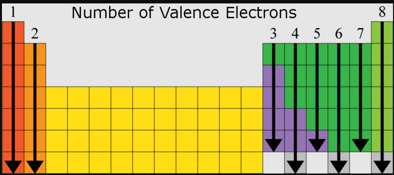
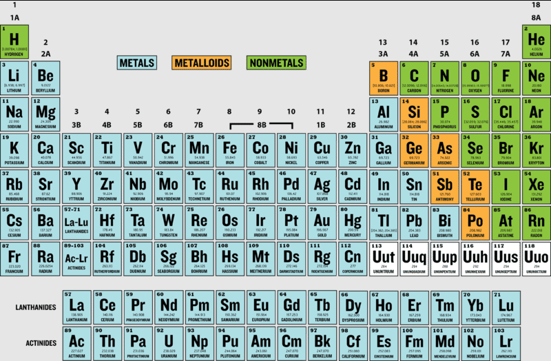

# Molecular and ionic compound structure and properties

## Ionic Bonds and Interactions Between Atoms

1. **Introduction to Bonding**:
   - Atoms don't exist in isolation; they interact and bond to form compounds.
   - A bond is essentially a way for atoms to "stick" together, leading to the formation of molecules or compounds.

2. **Types of Bonds**:
   - Bonding occurs on a spectrum, ranging from sharing electrons (covalent bonds) to complete transfer of electrons (ionic bonds).
   - Ionic bonds are considered one of the more extreme types of bonds.

3. **Formation of Ionic Bonds**:
   - **Key Participants**:
     - **Group 1 Elements (Alkali Metals)**: These atoms, like sodium ($Na$), have one valence electron and tend to lose it.
     - **Group 17 Elements (Halogens)**: These atoms, like chlorine ($Cl$), have seven valence electrons and tend to gain one electron to complete their outer shell.
   - **Lewis Dot Structures**:
     - Sodium ($Na$) has one dot (one valence electron).
     - Chlorine ($Cl$) has seven dots (seven valence electrons).
   - **Electron Transfer**:
     - Sodium loses its one valence electron, becoming a **sodium cation ($Na+$)** with a positive charge.
     - Chlorine gains one electron, becoming a **chloride anion ($Cl-$)** with a negative charge.
   - **Coulomb Attraction**:
     - The positively charged $Na+$ and the negatively charged $Cl-$ attract each other due to opposite charges, forming a stable ionic bond.

4. **Properties of Ionic Compounds**:
   - The resulting compound, **sodium chloride ($NaCl$)**, is neutral overall because the charges of the $Na+$ and $Cl-$ ions balance each other.
   - The ionic bond is the result of **electrostatic forces** between oppositely charged ions.

5. **Summary of the Process**:
   - **Initial State**:
     - Sodium wants to lose an electron to achieve a stable electron configuration (like a noble gas).
     - Chlorine wants to gain an electron to complete its valence shell.
   - **Reaction**:
     - Sodium donates its electron to chlorine.
   - **Final State**:
     - Sodium becomes $Na+$ (cation), chlorine becomes $Cl-$ (anion).
     - The two ions attract, forming a strong ionic bond and creating the compound sodium chloride ($NaCl$).

This process exemplifies the fundamental principle of ionic bonding: the transfer of electrons between atoms leads to the formation of ions that attract each other due to their opposite charges.

## Covalent and Polar Covalent Bonds

1. **Introduction to Covalent Bonds**:
   - In covalent bonds, **atoms share electrons** instead of transferring them (as in ionic bonds).
   - This sharing allows each atom to achieve a more stable electron configuration.

2. **Formation of Covalent Bonds**:
   - Example: **Oxygen Molecule (O₂)**:
     - Each oxygen atom has six valence electrons.
     - Both atoms share two unpaired electrons with each other, forming two shared pairs.
     - Represented as O=O, where each line represents a pair of shared electrons.
     - Each oxygen atom effectively has eight valence electrons (a stable configuration).
   - **Covalent Bond Representation**:
     - A single line (-) represents a single bond (two shared electrons).
     - A double line (=) represents a double bond (four shared electrons).

3. **Covalent Bonds in Water (H₂O)**:
   - Oxygen has six valence electrons, while each hydrogen has one.
   - Oxygen shares one electron with each hydrogen, forming two single covalent bonds.
   - Oxygen achieves eight valence electrons, and each hydrogen achieves two, stabilizing both.

4. **Electronegativity and Polar Covalent Bonds**:
   - **Electronegativity**:
     - A measure of how strongly an atom attracts shared electrons.
     - Elements on the top-right of the periodic table (like oxygen) are more electronegative.
   - **Polar Covalent Bonds**:
     - In H₂O, oxygen is more electronegative than hydrogen.
     - Shared electrons spend more time near oxygen, creating a **partial negative charge (δ⁻)** on oxygen.
     - Hydrogen ends of the molecule have a **partial positive charge (δ⁺)**.
     - This creates a dipole (uneven distribution of charge), making water a polar molecule.

5. **Characteristics of Polar Covalent Bonds**:
   - Uneven sharing of electrons leads to regions of partial positive and negative charge.
   - Polar covalent bonds are significant in molecules like water, where polarity affects properties such as solubility and hydrogen bonding.

6. **Types of Covalent Bonds**:
   - **Pure Covalent Bonds**:
     - Equal sharing of electrons between atoms with similar electronegativity (e.g., O₂, N₂).
   - **Polar Covalent Bonds**:
     - Unequal sharing of electrons due to differing electronegativity (e.g., H₂O, HF).

### Summary:
- **Covalent bonds** involve **electron sharing** between atoms to achieve stability.
- **Polar covalent bonds** occur when electrons are unequally shared, leading to partial charges on the bonded atoms.
- The polarity of bonds influences the properties of molecules, such as solubility and reactivity.

---

## Metallic bonds
Metallic bonds result from the electrostatic attraction between metal cations and delocalized electrons. The nature of metallic bonding accounts for many of the physical properties of metals, such as conductivity and malleability.

--

## Representing ionic solids using particulate models

1. **Formation of Ionic Crystals**:
   - Ionic solids form by the **arrangement of cations and anions** in a lattice structure.
   - The arrangement maximizes **attractive forces** (between oppositely charged ions) and minimizes **repulsive forces** (between like-charged ions).

2. **Checkerboard Pattern in 2D**:
   - In a 2D slice of an ionic crystal:
     - Positive ions (cations) and negative ions (anions) alternate to ensure each ion is surrounded by oppositely charged ions.
     - This arrangement creates a **checkerboard pattern** in 2D and a more complex **lattice** in 3D.

3. **Coulomb Forces**:
   - Opposite charges attract, and like charges repel.
   - Ionic solids arrange themselves to **optimize Coulomb forces**, enhancing the stability of the structure.

4. **Size of Ions in Ionic Crystals**:
   - The relative sizes of cations and anions affect the structure of the lattice.
   - **Example**: Rubidium bromide (RbBr)
     - **Rubidium cation (Rb⁺)**:
       - Has fewer electrons than the neutral atom (electron configuration like krypton).
       - Its outer electrons are pulled closer to the nucleus due to the excess of protons, making it **smaller**.
     - **Bromide anion (Br⁻)**:
       - Gains an extra electron, creating increased electron-electron repulsion, making it **larger**.

5. **Periodic Table Insights**:
   - **Cations (e.g., rubidium)**: Tend to be smaller than their neutral atoms because they lose electrons.
   - **Anions (e.g., bromide)**: Tend to be larger than their neutral atoms because they gain electrons.

6. **Rubidium Bromide Lattice**:
   - The lattice structure shows **smaller rubidium cations** surrounded by **larger bromide anions**.
   - Accurate **particulate models** represent this size difference, though the difference isn't dramatic as both ions have the same number of electrons but different nuclear charges.

7. **General Notes on Ionic Lattices**:
   - The size and charge of ions influence the overall geometry and spacing in the lattice.
   - Ionic lattices are highly ordered, creating **stable crystalline structures**. 

This structural understanding explains why ionic solids have high melting points, as significant energy is required to overcome the strong electrostatic forces in the lattice.

---

## Representing alloys using particulate models

### **Metallic Bonds and Properties**
1. **Metallic Bonds**:
   - Metals form bonds by contributing their **valence electrons** to a communal "sea of electrons."
   - This "sea of electrons" allows for properties like:
     - **Electrical conductivity**: Electrons can move freely.
     - **Malleability**: Layers of atoms can slide without breaking the structure.
     - **Shininess**: Reflects light due to electron interactions.

2. **Metallic Properties**:
   - Metals are shiny, malleable, and good conductors of electricity due to the delocalized electrons.

---

### **What Are Alloys?**
1. **Definition**:
   - Alloys are mixtures of metals (and sometimes nonmetals) that retain metallic properties.
   - Example: **Steel**, **Brass**, **Stainless Steel**.

2. **Why Alloys?**
   - Adding other elements alters and often enhances properties:
     - **Steel**: Stronger than pure iron due to the addition of carbon.
     - **Stainless Steel**: Resistant to corrosion due to chromium.

---

### **Types of Alloys**
1. **Interstitial Alloys**:
   - **Composition**:
     - A smaller atom (e.g., carbon) fits into the spaces (interstices) between larger metal atoms (e.g., iron).
   - **Example**: **Steel**.
     - Iron atoms form the main structure, and smaller carbon atoms fill gaps, strengthening the material.

2. **Substitutional Alloys**:
   - **Composition**:
     - Atoms of similar size replace each other in the metallic structure.
   - **Example**: **Brass**.
     - Zinc atoms substitute some of the copper atoms.

3. **Combination Alloys**:
   - **Composition**:
     - Contains features of both interstitial and substitutional alloys.
   - **Example**: **Stainless Steel**.
     - Iron (main structure) with chromium (substitutional) and carbon (interstitial).
   - **Benefits**:
     - Enhanced strength and corrosion resistance.

---

### **Advantages of Alloying**
1. **Strength**:
   - Example: Steel is stronger than pure iron because carbon atoms restrict the movement of iron atoms.
   
2. **Corrosion Resistance**:
   - Example: Chromium in stainless steel prevents oxidation (rusting).

3. **Custom Properties**:
   - Alloying allows for the fine-tuning of properties like conductivity, hardness, and resistance to wear.

---

Alloys are essential for modern materials science, combining the best properties of their components to meet specific engineering needs.

--- 

## Drawing Lewis diagrams





### Steps to Build a Lewis Diagram

A Lewis diagram (or Lewis structure) represents the valence electrons in atoms and molecules. These diagrams help visualize bonding and lone electron pairs. Follow these steps:

---

### **1. Count the Total Valence Electrons**
   - **Determine the valence electrons** for each atom in the molecule using the periodic table.
     - Group 1: 1 valence electron
     - Group 2: 2 valence electrons
     - Group 13–18: Number of valence electrons corresponds to the group number (minus 10 for 13–18).
   - **Add/Subtract for Charges**:
     - For **negative ions**, add electrons equal to the charge.
     - For **positive ions**, subtract electrons equal to the charge.

---

### **2. Determine the Central Atom**
   - The central atom is usually:
     - **Less electronegative** than the others (except hydrogen, which is never the central atom).
     - Often listed first in the chemical formula.
     - For symmetrical molecules (like $\text{CO}_2$), the arrangement will be linear or balanced.

---

### **3. Arrange Atoms and Draw Single Bonds**
   - **Connect the central atom to surrounding atoms** with single bonds ($2$ electrons per bond).
   - Subtract the electrons used in the bonds from the total valence electrons.

---

### **4. Complete Octets for Outer Atoms**
   - Fill the octet (8 electrons) for each outer atom, except:
     - **Hydrogen**: Stable with $2$ electrons.
     - **Helium**: Stable with $2$ electrons.
     - **Boron** and **aluminum** can be stable with fewer than $8$ electrons.

---

### **5. Place Remaining Electrons on the Central Atom**
   - Add any leftover electrons to the central atom as lone pairs.
   - If the central atom is in **Period 3 or higher**, it can hold more than $8$ electrons due to its expanded valence shell.

---

### **6. Check Octets and Form Multiple Bonds (if Needed)**
   - If the central atom doesn’t have a full octet:
     - **Move lone pairs** from outer atoms to form double or triple bonds.
     - Recheck total electrons after forming these bonds.

---

### **7. Verify the Structure**
   - **Check the total electron count**:
     - Ensure the total matches the number of valence electrons calculated in Step 1.
   - **Check formal charges**:
     - Formal charge = $ \text{Valence electrons} - \text{Non-bonding electrons} - \frac{\text{Bonding electrons}}{2} $.
     - Aim for a structure where the formal charges are minimized, ideally $0$ for neutral molecules or consistent with the ion's charge.

---

### **8. Draw Resonance Structures (if Applicable)**
   - If there are multiple valid ways to arrange electrons, draw all resonance structures with a double-headed arrow ($\leftrightarrow$) between them.

---

### Example: Lewis Structure of $ \text{CO}_2 $
1. **Valence Electrons**:
   - Carbon: $4$ (Group 14).
   - Oxygen: $6 \times 2 = 12$.
   - Total: $4 + 12 = 16$.

2. **Central Atom**: Carbon (less electronegative).

3. **Single Bonds**:
   $
   \text{O—C—O} \quad (\text{4 electrons used, 12 left})
   $

4. **Octets for Outer Atoms**:
   - Add $6$ electrons to each oxygen.
   - Total electrons used: $4 (\text{bonds}) + 12 (\text{octets}) = 16$.

5. **Central Atom’s Octet**:
   - Move lone pairs from oxygens to form two double bonds.
   - Final structure:
     $
     \text{O=C=O}
     $

6. **Verify**:
   - Total electrons: $16$.
   - Each atom has a full octet.
   - Formal charge: $0$ on all atoms.

### **Resonance**
Resonance used to describe the delocalization of electrons in molecules or polyatomic ions where the bonding cannot be represented by a single Lewis structure. Instead, resonance structures are multiple valid Lewis structures that collectively represent the actual bonding and electron distribution in the molecule.

1. **Delocalized Electrons**:
   - Resonance occurs when electrons, typically in $ \pi $-bonds or lone pairs, are spread over multiple atoms instead of being confined to a single bond or atom.

2. **Multiple Structures**:
   - Resonance structures are different ways of arranging electrons in a molecule while keeping the positions of the atoms unchanged.

3. **Actual Structure is a Hybrid**:
   - The true structure of the molecule, called the **resonance hybrid**, is a weighted average of all resonance structures. It is more stable and lower in energy than any single resonance structure.

4. **Equivalence**:
   - All resonance structures may not contribute equally to the hybrid. Structures with lower energy (more stable) contribute more.

5. **Formal Charges**:
   - Resonance structures often redistribute formal charges to achieve stability.

---

### **Examples of Resonance**

#### **1. Benzene ($ \text{C}_6\text{H}_6 $)**:
- Benzene has alternating single and double bonds in its ring structure.
- Resonance structures:
  $$
  \text{Structure 1: } \, \text{Single and double bonds alternate clockwise.}
  $$
  $$
  \text{Structure 2: } \, \text{Single and double bonds alternate counterclockwise.}
  $$
- **Resonance Hybrid**:
  - Benzene's true structure has delocalized $ \pi $-electrons evenly distributed around the ring, often depicted as a circle inside a hexagon.

#### **2. Ozone ($ \text{O}_3 $)**:
- Ozone can be represented with a double bond on one side and a single bond on the other:
  - $$
    \text{O=O-O} \quad \text{and} \quad \text{O-O=O}.
  $$
- **Resonance Hybrid**:
  - The bond lengths are equal between the oxygen atoms, indicating delocalized electrons.

---

### **Importance of Resonance**
1. **Stability**:
   - Resonance increases the stability of molecules due to electron delocalization, which spreads out charge and reduces repulsion.
   
2. **Bond Characteristics**:
   - Resonance explains bond lengths and strengths that differ from those expected in simple Lewis structures (e.g., fractional bond orders).

3. **Reactivity**:
   - Molecules with resonance often have unique reactivities because of delocalized electrons (e.g., aromaticity in benzene).

4. **Acidity/Basicity**:
   - Resonance stabilizes conjugate bases, affecting acidity (e.g., carboxylic acids).

Resonance is a fundamental concept in understanding molecular stability, bonding, and chemical behavior.

---

## Formal Charge

### **What is Formal Charge?**

Formal charge is a bookkeeping tool used in chemistry to determine the apparent charge of an atom in a molecule, assuming that electrons in a bond are shared equally between the bonded atoms. It helps in analyzing molecular structures, evaluating resonance forms, and predicting which resonance structure contributes most to the resonance hybrid.

---

### **Formula for Calculating Formal Charge**

$
\text{Formal Charge} = (\text{Number of valence electrons in free atom}) - (\text{Number of lone pair electrons}) - \frac{1}{2} (\text{Number of shared electrons})
$

Where:
1. **Number of valence electrons in free atom**: The number of electrons in the outermost shell of the neutral atom (based on the periodic table).
2. **Number of lone pair electrons**: The non-bonding electrons directly assigned to the atom.
3. **Number of shared electrons**: Electrons in covalent bonds, divided equally between the bonded atoms.

---

### **Steps to Calculate Formal Charge**

1. **Determine the Number of Valence Electrons for the Free Atom**:
   Look up the atom's group number on the periodic table.

2. **Count Lone Pair Electrons**:
   Count the unshared (non-bonding) electrons directly on the atom.

3. **Count Shared Electrons**:
   Count all bonding electrons connected to the atom and divide by 2.

4. **Apply the Formula**:
   Subtract the allocated electrons (lone pair + half of shared) from the free atom's valence electrons.

---

### **Example: Nitrous Acid (HNO₂)**

#### **Structure 1**:

```
H - O - N = O
```

1. **Hydrogen**:
   - Valence electrons: 1
   - Lone pairs: 0
   - Shared electrons: 2 (1 bond)
   - Formal Charge: $ 1 - 0 - \frac{2}{2} = 0 $

2. **Oxygen (bonded to H)**:
   - Valence electrons: 6
   - Lone pairs: 4
   - Shared electrons: 4 (2 bonds)
   - Formal Charge: $ 6 - 4 - \frac{4}{2} = +1 $

3. **Nitrogen**:
   - Valence electrons: 5
   - Lone pairs: 2
   - Shared electrons: 6 (3 bonds)
   - Formal Charge: $ 5 - 2 - \frac{6}{2} = 0 $

4. **Oxygen (double-bonded to N)**:
   - Valence electrons: 6
   - Lone pairs: 4
   - Shared electrons: 4 (1 double bond)
   - Formal Charge: $ 6 - 4 - \frac{4}{2} = 0 $

---

#### **Structure 2**:

```
H - O - N - O (with one lone pair and a double bond)
```

1. **Hydrogen**:
   Same as Structure 1, Formal Charge: $ 0 $

2. **Oxygen (bonded to H)**:
   - Valence electrons: 6
   - Lone pairs: 4
   - Shared electrons: 2 (1 bond)
   - Formal Charge: $ 6 - 4 - \frac{2}{2} = 0 $

3. **Nitrogen**:
   - Valence electrons: 5
   - Lone pairs: 2
   - Shared electrons: 6 (3 bonds)
   - Formal Charge: $ 5 - 2 - \frac{6}{2} = 0 $

4. **Oxygen (double-bonded to N)**:
   - Valence electrons: 6
   - Lone pairs: 4
   - Shared electrons: 4 (1 double bond)
   - Formal Charge: $ 6 - 4 - \frac{4}{2} = 0 $

---

### **Key Insights**:
1. The structure with formal charges closest to zero is more stable and contributes more to the resonance hybrid.
2. In these examples, **Structure 2** (with no formal charges) is the dominant resonance structure for nitrous acid.

---

### **Importance of Formal Charge**:
1. Helps identify the most stable Lewis structure.
2. Aids in predicting molecular geometry and reactivity.
3. Supports understanding of resonance and delocalization in molecules.

## Valence Shell Electron Pair Repulsion (VSEPR)

### **Using VSEPR to Predict Molecular Shapes**

The **Valence Shell Electron Pair Repulsion (VSEPR)** model is a powerful tool for predicting the shapes of molecules and ions based on the repulsion between electron clouds (regions of electron density) around a central atom.

---

### **Steps to Predict Molecular Shapes Using VSEPR**

#### 1. **Draw the Lewis Structure**  
   - Identify the total number of valence electrons for all atoms in the molecule or ion.
   - Arrange the atoms to form single bonds to the central atom.
   - Distribute remaining electrons to satisfy the octet rule (or duet for hydrogen), starting with terminal atoms.
   - If necessary, create multiple bonds to satisfy the central atom’s octet and minimize formal charges.

---

#### 2. **Count Electron Clouds (Regions of Electron Density)**  
   - **Definition of Electron Cloud**: A region of electron density can be:
     - A single bond
     - A double bond
     - A triple bond
     - A lone pair of electrons
   - Count all such regions around the central atom.

---

#### 3. **Determine Electron Geometry**  
   - Use the number of electron clouds to predict the basic electron geometry:
     - **2 Clouds**: Linear  
     - **3 Clouds**: Trigonal planar  
     - **4 Clouds**: Tetrahedral  
     - **5 Clouds**: Trigonal bipyramidal  
     - **6 Clouds**: Octahedral  

---

#### 4. **Account for Lone Pairs**  
   - Lone pairs take up more space than bonding pairs due to stronger electron-electron repulsion.
   - Adjust the shape accordingly (molecular geometry), focusing only on the positions of atoms, not the lone pairs:
     - Example: A tetrahedral electron geometry becomes **trigonal pyramidal** if one cloud is a lone pair.

---

#### 5. **Predict Molecular Geometry and Bond Angles**  
   - Use the adjusted geometry to determine the 3D shape of the molecule or ion.
   - Approximate bond angles based on the molecular shape.

---

### **Examples**

#### **1. Beryllium Chloride ($\text{BeCl}_2$)**
- **Step 1**: Draw the Lewis structure.
  - Beryllium ($2$ valence electrons) forms two single bonds with two chlorines ($7$ valence electrons each).
  - Chlorines satisfy the octet rule with lone pairs; beryllium has $4$ electrons (does not follow the octet rule).
- **Step 2**: Count electron clouds.
  - Two single bonds = $2$ electron clouds.
- **Step 3**: Determine electron geometry.
  - **Linear** (two clouds repel to maximize distance).
- **Step 4**: Lone pairs.
  - None on the central atom.
- **Step 5**: Molecular geometry.
  - **Linear** shape with a $180^\circ$ bond angle.

---

#### **2. Carbon Dioxide ($\text{CO}_2$)**
- **Step 1**: Draw the Lewis structure.
  - Carbon ($4$ valence electrons) forms two double bonds with two oxygens ($6$ valence electrons each).
  - Each oxygen satisfies the octet rule; carbon is also satisfied.
- **Step 2**: Count electron clouds.
  - Two double bonds = $2$ electron clouds (each double bond counts as one region).
- **Step 3**: Determine electron geometry.
  - **Linear** (two clouds repel to maximize distance).
- **Step 4**: Lone pairs.
  - None on the central atom; lone pairs are on the terminal oxygens.
- **Step 5**: Molecular geometry.
  - **Linear** shape with a $180^\circ$ bond angle.

---

### **Key Notes**
- The **electron geometry** is determined by all electron clouds (bonding + lone pairs).  
- The **molecular geometry** focuses only on the arrangement of bonded atoms.
- Lone pairs compress bond angles due to stronger repulsion compared to bonding pairs.

By applying these steps systematically, you can predict the shape and bond angles for a wide variety of molecules and ions.

