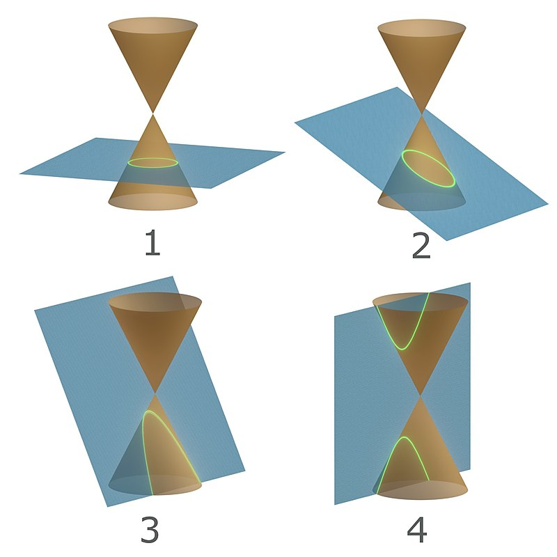

# Conic Sections

Identifying conic sections involves analyzing their equations and understanding the geometric properties they represent. Here are some tricks to help identify and understand conic sections:

### Types of Conic Sections
1. **Circle**
2. **Ellipse**
3. **Parabola**
4. **Hyperbola**

### General Equation
The general form of a conic section is:
$$ Ax^2 + Bxy + Cy^2 + Dx + Ey + F = 0 $$

### Steps to Identify Conic Sections

1. **Check the Bxy term:**
   - If $B = 0$, the conic section does not have a rotation.

2. **Check coefficients $ A $ and $ C $:**
   - Circle: $A = C$ and $ B = 0 $
   - Ellipse: $ A \neq C $, $ A $ and $ C $ have the same sign, and $ B = 0 $
   - Parabola: Either $ A = 0 $ or $ C = 0 $, but not both
   - Hyperbola: $ A $ and $ C $ have opposite signs, and $ B = 0 $

### Discriminant Method
Calculate the discriminant, $\Delta = B^2 - 4AC$:
- Circle: $ \Delta < 0 $ and $ A = C $
- Ellipse: $ \Delta < 0 $ and $ A \neq C $
- Parabola: $ \Delta = 0 $
- Hyperbola: $ \Delta > 0 $

### Specific Cases and Forms
1. **Circle:**
   - Standard form: $ (x - h)^2 + (y - k)^2 = r^2 $
   - General form: $ Ax^2 + Ay^2 + Dx + Ey + F = 0 $ with $ A > 0 $ and $ A = C $

2. **Ellipse:**
   - Standard form: $\frac{(x - h)^2}{a^2} + \frac{(y - k)^2}{b^2} = 1 $
   - General form: $ Ax^2 + Cy^2 + Dx + Ey + F = 0 $ with $ A > 0 $, $ C > 0 $, and $ A \neq C $

3. **Parabola:**
   - Standard form (horizontal): $ (y - k)^2 = 4p(x - h) $
   - Standard form (vertical): $ (x - h)^2 = 4p(y - k) $
   - General form: $ Ax^2 + Dx + Ey + F = 0 $ or $ Cy^2 + Dx + Ey + F = 0 $

4. **Hyperbola:**
   - Standard form (horizontal): $\frac{(x - h)^2}{a^2} - \frac{(y - k)^2}{b^2} = 1 $
   - Standard form (vertical): $\frac{(y - k)^2}{b^2} - \frac{(x - h)^2}{a^2} = 1 $
   - General form: $ Ax^2 - Cy^2 + Dx + Ey + F = 0 $ with $ A > 0 $ and $ C < 0 $ or vice versa

### Quick Identification Tips
- **Circle:** Equal coefficients for $ x^2 $ and $ y^2 $ with no $ xy $ term.
- **Ellipse:** Unequal coefficients for $ x^2 $ and $ y^2 $ with same signs and no $ xy $ term.
- **Parabola:** Either $ x^2 $ or $ y^2 $ term is missing.
- **Hyperbola:** Coefficients for $ x^2 $ and $ y^2 $ have opposite signs.

### Practice Examples
1. Identify the conic section for $ 3x^2 + 3y^2 - 9 = 0 $:
   - Simplify to $ x^2 + y^2 = 3 $
   - This is a circle.

2. Identify the conic section for $ 4x^2 + 9y^2 - 36 = 0 $:
   - Simplify to $ \frac{x^2}{9} + \frac{y^2}{4} = 1 $
   - This is an ellipse.

3. Identify the conic section for $ x^2 - y^2 = 1 $:
   - This is a hyperbola.

4. Identify the conic section for $ y^2 - 4x = 0 $:
   - Rewrite as $ y^2 = 4x $
   - This is a parabola.

By following these guidelines and practicing with different equations, you'll become proficient at identifying conic sections quickly.